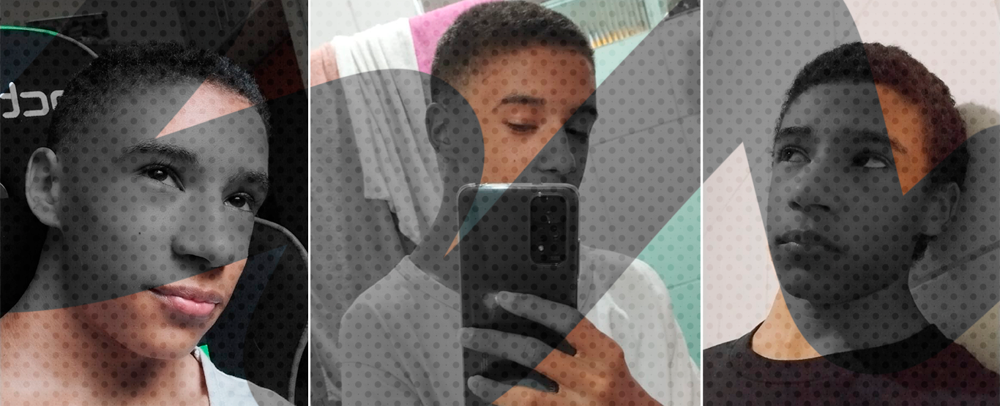

# Nick who?
I am **Nícolas Gabriel**, most known by **Nick Gabe**, the creator of this Doc.
Currently a 18 year old brazilian Full Stack Programmer.

## Overview

I started learning about Programming in 2020 during the pandemic and while I was on high school. It was only a hobby, since I started only to develop a Discord Bot to joke with my friends. But I started to really like it and spend hours and hours studying. *I was more dedicated with that than high school to be honest*.

After some months doing a lot of projects I decided that this was my area and I would pursuit it. And after 2 years studying a lot, a week after my birthday, I got a message about a meeting for an foreign company! I was *really* happy when I got approved, my first job!

Since then I'm still working on that company, and it granted me a lot of things and chances to improve.

## Technical

[JavaScript](https://developer.mozilla.org/pt-BR/docs/Web/JavaScript) was my primary language, I started with it using [Node.js](https://nodejs.org/en/). I used and improved it for a long time, almost a year without any external stuff but libraries. During that, I developed many projects that are public on my [GitHub](https://github.com/nick-gabe).

After a year only working with JS, I started doing Front End stuff, using Html and Css. And the logic was easier to implement than the appearance and responsivity, I almost fell to the Back End side. But after persising, I started to like Css, and even did drawings with it.

:::tip
Drawing is a really good way to learn more about geometry and how everything can be recreated with Css, it only takes patience and a bunch of workarounds 😂
:::

Then, after some months, I went to try a framework, and decided to go for React. I don't remember why, but I choosed it. Studied a lot, created more and more projects. Learnt about States, Hooks, JSX, and then something stumbled in my way... Typescript!

At first glance I thought it was not useful at all, since it was only more code to do the same thing Javascript does. But after some time I learnt their pros and cons, and yeah, for me it is a pretty code language, I prefer it most of the time due to making big projects more scalable and safer to work with.

Then I learned Next, Strapi, a lot of libraries and here I am learning and trying this awesome SSG called Docusaurus 😁.

## Social Media

Follow me on my social media, also send a message :)
- **[Twitter](https://twitter.com/mynickisnick_)**
- **[GitHub](https://github.com/nick-gabe)**
- **[LinkedIn](https://linkedin.com/in/nicolas-gabriel)**
- **Discord:** Snickers#5005