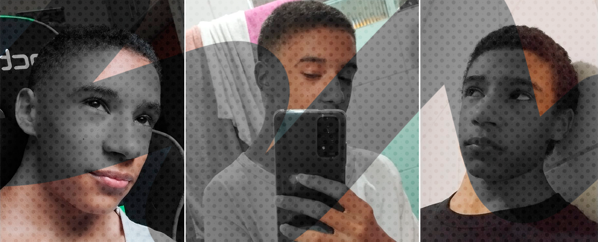

# Nick quem?
Eu sou **Nícolas Gabriel**, mais conhecido por **Nick Gabe**, o criador deste Doc.
Atualmente um programador Full Stack brasileiro de 18 anos.

## Visão geral

Comecei a aprender sobre Programação em 2020 durante a pandemia e enquanto estava no ensino médio. Era apenas um hobby, já que comecei apenas a desenvolver um bot do Discord para brincar com meus amigos. Mas comecei a gostar muito e ficar horas e horas estudando. *Eu me dediquei mais a isso do que à ensino médio, para ser sincero*.

Depois de alguns meses fazendo muitos projetos decidi que essa era a minha área e iria atrás dela. E depois de 2 anos estudando muito, uma semana depois do meu aniversário, recebi uma mensagem sobre uma entrevista para uma empresa estrangeira! Fiquei *muito* feliz quando fui aprovado, meu primeiro emprego!

Desde então continuo trabalhando naquela empresa, e ela me proporcionou muitas coisas e chances de melhorar.

## Técnico

[JavaScript](https://developer.mozilla.org/pt-BR/docs/Web/JavaScript) era minha linguagem principal, comecei com ela usando [Node.js](https://nodejs.org/en/). Usei e melhorei por muito tempo, quase um ano sem nenhum material externo além de bibliotecas. Durante isso, desenvolvi muitos projetos que são públicos no meu [GitHub](https://github.com/nick-gabe).

Depois de um ano usando apenas com JS, comecei a fazer coisas de Front End, usando Html e Css. E a lógica foi mais fácil de implementar do que a aparência e a responsividade, quase caí para o lado do Back End. Mas depois de insistir, comecei a gostar de Css, e até desenhava com ele.

:::tip
Desenhar é uma ótima maneira de aprender mais sobre geometria e como tudo pode ser recriado com Css, só requer paciência e um monte de gambiarras 😂
:::

Então, depois de alguns meses, fui experimentar um framework, e resolvi partir para o React. Não me lembro o porque, mas é isso aí. Estudei muito, criei cada vez mais projetos. Aprendi sobre States, Hooks, JSX, e então algo tropeçou no meu caminho... Typescript!

À primeira vista, pensei que não seria útil, pois era apenas código extra para fazer exatamente a mesma coisa que o Javascript faz. Mas depois de algum tempo eu aprendi seus prós e contras, e sim, para mim é uma linguagem ótima, eu prefiro na maioria das vezes por fazer grandes projetos mais escaláveis e seguros para trabalhar.

Então eu aprendi Next, Strapi, outras bibliotecas... e aqui estou aprendendo e experimentando este incrível SSG chamado Docusaurus 😁.

## Mídia social

Me segue aí nas minhas redes sociais, manda uma mensagem também po :)
- **[Twitter](https://twitter.com/mynickisnick_)**
- **[GitHub](https://github.com/nick-gabe)**
- **[LinkedIn](https://linkedin.com/in/nicolas-gabriel)**
- **Discord:** Snickers#5005